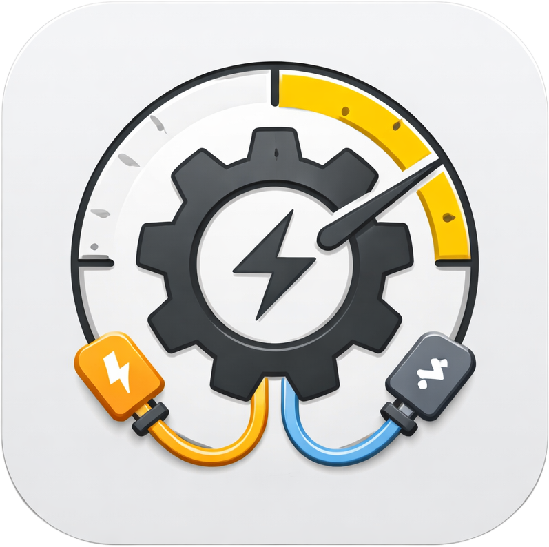

<p align="center">
  
</p>

# Gearbox ⚙️

Gearbox is a powerful macOS-native local automation manager. It allows you to schedule and manage background tasks with a clean, modern UI and a flexible CLI.

## Features

- **Native macOS Menu Bar UI**: Monitor and control tasks directly from your menu bar with a polished Swift-based app.
- **Live Log Streaming**: Watch your automations execute in real-time with built-in auto-scrolling. 📡
- **Accurate Status Tracking**: Clear visual indicators for **Success**, **Failed**, **Running**, and **Cancelled** tasks.
- **Smart Scheduling**: Flexible cron-based and natural language scheduling (e.g., "every 5 minutes", "mondays at 10:00").
- **Task Isolation**: Each task runs in its own process with full log capture.
- **Background Daemon**: A lightweight Python daemon manages the execution queue.
- **CLI Interface**: Powerful command-line tool for managing tasks.

## Installation

1. Clone the repository:
   ```bash
   git clone https://github.com/yourusername/gearbox.git
   cd gearbox
   ```

2. Run the installation script:
   ```bash
   ./install.sh
   ```

3. (Optional) Add the alias to your shell profile:
   ```bash
   # Add this to your ~/.zshrc or ~/.bash_profile
   alias gearbox='/path/to/gearbox/venv/bin/python /path/to/gearbox/cli.py'
   ```

## Usage

### CLI

- **Add a task**: `gearbox add my-task "*/5 * * * *" "echo hello"`
- **List tasks**: `gearbox ls`
- **View logs**: `gearbox logs my-task`
- **Pause/Resume**: `gearbox pause my-task` / `gearbox resume my-task`

### UI

The native macOS menu bar app starts automatically after installation. It provides a quick overview of active tasks and recent execution health.

## Development

Gearbox consists of:
- **Core (Python)**: Task management, database (SQLite), and scheduling logic.
- **Daemon (Python)**: The background process that executes tasks.
- **CLI (Python/Click)**: Command-line interface.
- **UI (Swift)**: Native macOS menu bar application.

To build the UI manually:
```bash
./build_ui.sh
```

## Testing

### Python Backend
Testing is handled with `pytest`. To run the tests, use the provided virtual environment:
```bash
./venv/bin/python3 -m pytest tests/
```

### Swift UI
Testing is handled with `XCTest`. Run tests from the `GearboxUI` directory:
```bash
cd GearboxUI
swift test
```

## License

Standard Apache 2.0 License. See [LICENSE](LICENSE) for details.
