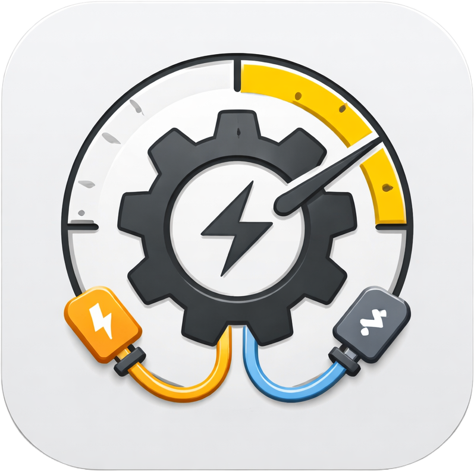

<p align="center">
  
</p>

# Gearbox ⚙️

[](https://github.com/hgayan7/gearbox/releases/tag/v1.3.0)
[](LICENSE)
[](https://apple.com/macos)
[](https://www.python.org/)

**Gearbox** is a resilient, local-first automation and background task manager for macOS. Built with a native **SwiftUI** menu bar interface, an integrated **`launchd`** daemon engine, and a versatile **CLI**, Gearbox bridges simple cron jobs and production-grade task scheduling on your Mac.

---

### Why Gearbox? ⚙️
- 🔒 **Local-First & Private**: Zero external cloud dependency. All metadata, run histories, and configurations reside in a local SQLite database (`~/.gearbox/gearbox.db`).
- ⚡️ **macOS Native Integration**: Runs smoothly in the menu bar with real-time gear spin activity, failure dot indicators, Apple Shortcuts `AppIntents`, and rich actionable notifications.
- 🛡️ **Execution Resilience**: Built-in per-task timeouts, automatic exponential retries with backoff, and pipeline chaining (`on-success` and `on-failure` hooks).
- 📂 **Multi-Trigger Modalities**: Trigger jobs on human-friendly cron intervals or instantly when files/directories change via native `launchd` `WatchPaths`.
- 🔋 **Battery & Power Safety**: Restrict heavy workloads to AC power and prevent macOS system sleep during critical runs using `caffeinate`.
- 📑 **Declarative GitOps**: Export, version control, and reconcile your entire automation stack with a declarative `Gearboxfile.yaml`.
- 🩺 **Self-Healing Doctor**: Built-in `gearbox doctor` detects orphaned launch agents, permission drifts, and PATH traps with automatic one-click remediation.
- 🌐 **Local Webhook Server**: Trigger and inspect tasks from Raycast, Alfred, shell scripts, or external tools via an Apple `Network.framework` loopback HTTP API.

---

https://github.com/user-attachments/assets/51500ad3-2145-4a78-9967-f05fe34f038b

<p align="center">
  
</p>

---

## Table of Contents
- [Installation](#installation)
  - [Homebrew (Recommended)](#homebrew-recommended)
  - [From Source](#from-source)
- [Key Features & Capabilities](#key-features--capabilities)
  - [1. Multi-Trigger Modalities](#1-multi-trigger-modalities)
  - [2. Execution Resilience & Pipelines](#2-execution-resilience--pipelines)
  - [3. Battery & Power Safety](#3-battery--power-safety)
  - [4. Declarative GitOps (Gearboxfile)](#4-declarative-gitops-gearboxfile)
  - [5. System Doctor & Diagnostics](#5-system-doctor--diagnostics)
  - [6. Apple Shortcuts & App Intents](#6-apple-shortcuts--app-intents)
  - [7. Local Webhook HTTP Server](#7-local-webhook-http-server)
  - [8. Menu Bar Activity & Deep Linking](#8-menu-bar-activity--deep-linking)
- [CLI Reference](#cli-reference)
- [Declarative Specification Example (`Gearboxfile.yaml`)](#declarative-specification-example-gearboxfileyaml)
- [Local Webhook API Reference](#local-webhook-api-reference)
- [Architecture & Development](#architecture--development)
- [Testing](#testing)
- [License](#license)

---

## Installation

### Homebrew (Recommended)

Install the pre-built standalone app via the official Homebrew tap:

```bash
brew tap hgayan7/gearbox
brew install --cask gearbox
open -a Gearbox
```

> [!NOTE]
> On the very first launch, macOS Gatekeeper may prompt for approval. If prompted, navigate to **System Settings > Privacy & Security** and click **Open Anyway**. Once approved, Gearbox runs permanently in your menu bar.

### From Source

Requirements: macOS 13+ (Ventura or later), Python >= 3.9, Xcode Command Line Tools.

```bash
git clone https://github.com/hgayan7/gearbox.git
cd gearbox
./install.sh
```

To build and install the native SwiftUI app bundle locally:
```bash
./build_ui.sh
```

---

## Key Features & Capabilities

### 1. Multi-Trigger Modalities
Gearbox supports two primary execution triggers:
- **Cron / Schedule**: Human-friendly schedules (`"daily | 10:00"`, `"every 15 minutes"`, `"monday,friday 14:00"`, or standard 5-part cron syntax `"0 10 * * 1-5"`).
- **File & Folder Watcher (`WatchPaths`)**: Trigger tasks immediately whenever a designated directory or file is modified:
  ```bash
  gearbox add ingest-downloads "watch" "python process.py" \
    --trigger-type file_watch \
    --watch-path ~/Downloads
  ```

### 2. Execution Resilience & Pipelines
Never let hung processes or transient network glitches derail your automations:
- **Timeouts**: Enforce maximum execution runtime (e.g. `--timeout 120`). Jobs exceeding the timeout are cleanly terminated (`SIGTERM` followed by `SIGKILL`).
- **Retries with Exponential Backoff**: Automatically retry failed runs (e.g. `--max-retries 3 --retry-delay 15`).
- **Pipeline Chaining**: Trigger downstream tasks conditionally on completion:
  - `--on-success <task_name>`: Runs only when the current task finishes with exit code 0.
  - `--on-failure <task_name>`: Runs if the task fails after exhausting all retries.

### 3. Battery & Power Safety
Protect your laptop's battery and prevent task interruptions:
- **AC Power Detection (`--requires-ac`)**: Queries macOS `pmset` before execution. If the Mac is running on battery power, the task execution is skipped to preserve battery life.
- **Sleep Prevention (`--prevent-sleep`)**: Wraps execution in macOS `caffeinate` to keep system hardware awake until the task finishes.

### 4. Declarative GitOps (Gearboxfile)
Manage automations as code across machines or dotfiles repositories (`~/.config/gearbox/Gearboxfile.yaml`):
- **Export**: Dump all current tasks to YAML or JSON:
  ```bash
  gearbox export -o Gearboxfile.yaml
  ```
- **Apply**: Idempotently create and update tasks from a specification file:
  ```bash
  gearbox apply -f Gearboxfile.yaml --prune
  ```
- **Sync**: Automatically reconcile tasks from local or dotfile configurations:
  ```bash
  gearbox sync
  ```
- **UI Integration**: Import and export configurations directly from the Desktop window toolbar.

### 5. System Doctor & Diagnostics
Keep your macOS automation environment healthy with `gearbox doctor`:
```bash
gearbox doctor
```
Checks:
- Python runtime version (\(\ge 3.9\)) and required dependencies.
- SQLite database permissions and runtime directory security (`0o700`).
- LaunchAgents status and detection of orphaned `.plist` files.
- Binary PATH traps (detects commands referencing binaries outside standard launchd search paths).
- Automatic repair: Run `gearbox doctor --fix` to safely purge orphaned plists and remediate permissions.

### 6. Apple Shortcuts & App Intents
Automate Gearbox using the native macOS **Shortcuts** app:
- **Run Task**: Run any registered task immediately by name.
- **Pause Task**: Temporarily suspend scheduled executions.
- **Resume Task**: Re-enable an existing task schedule.

### 7. Local Webhook HTTP Server
Gearbox embeds a lightweight loopback server on `127.0.0.1:43272` powered by Apple's native `Network.framework`. Trigger tasks from raycast scripts, Alfred workflows, or curl:
```bash
# Check status
curl http://127.0.0.1:43272/status

# Trigger a task immediately
curl -X POST http://127.0.0.1:43272/run/my-task
```

### 8. Menu Bar Activity & Deep Linking
- **Live Running Activity**: Menu bar gear icon rotates smoothly during active runs.
- **Next Run Countdown**: Displays a countdown header to the next upcoming scheduled job.
- **Failure Indicator**: Persistent red dot badge alerts you to recent task failures.
- **Actionable Notifications**: Clicking "Run Again" on a failure alert re-runs the task instantly.
- **Deep Linking**: Trigger any task from browsers or terminal via `gearbox://run/<task_name>`.

---

## CLI Reference

| Command | Description | Example |
| :--- | :--- | :--- |
| `gearbox add` | Register a new scheduled or file-watched task | `gearbox add backup "daily 02:00" "./backup.sh" --timeout 300` |
| `gearbox update` | Modify configuration of an existing task | `gearbox update backup backup "daily 03:00" "./backup.sh"` |
| `gearbox ls` | List all tasks, schedules, triggers, and active flags | `gearbox ls` |
| `gearbox run` | Execute a task immediately in the background | `gearbox run backup` |
| `gearbox stop` | Terminate an actively running task process | `gearbox stop backup` |
| `gearbox pause` | Temporarily pause a task's schedule | `gearbox pause backup` |
| `gearbox resume` | Resume a paused task schedule | `gearbox resume backup` |
| `gearbox rm` | Remove a task and uninstall its launchd plist | `gearbox rm backup` |
| `gearbox logs` | View stdout and stderr output from latest execution | `gearbox logs backup` |
| `gearbox history` | Display tabular execution history with exit codes | `gearbox history backup --limit 10` |
| `gearbox export` | Export tasks to a declarative Gearboxfile (YAML/JSON) | `gearbox export -o Gearboxfile.yaml` |
| `gearbox apply` | Apply declarative tasks from a specification file | `gearbox apply -f Gearboxfile.yaml --prune` |
| `gearbox sync` | Reconcile tasks from local or dotfile Gearboxfile | `gearbox sync` |
| `gearbox doctor` | Audit and repair system health, LaunchAgents, and PATH | `gearbox doctor --fix` |

### `gearbox add` / `update` Flags
- `--trigger-type [cron|file_watch]` (default: `cron`)
- `--watch-path <path>`: Directory path to monitor when trigger is `file_watch`.
- `--timeout <seconds>`: Maximum execution duration (0 = unlimited).
- `--max-retries <count>`: Number of retry attempts upon task failure.
- `--retry-delay <seconds>`: Delay between retry attempts (default: 10s).
- `--requires-ac / --no-requires-ac`: Only execute when connected to wall power.
- `--prevent-sleep / --no-prevent-sleep`: Keep macOS awake during execution.
- `--on-success <task>`: Task name or ID to trigger on success.
- `--on-failure <task>`: Task name or ID to trigger on final failure.
- `--working-directory <path>`: Working directory for task process.
- `--env-json <json>`: JSON string of environment variables.
- `--shell <path>`: Shell executable path (e.g. `/bin/zsh`).

---

## Declarative Specification Example (`Gearboxfile.yaml`)

```yaml
version: "1"
tasks:
  - name: nightly-database-dump
    schedule: "0 2 * * *"
    command: "python scripts/backup.py"
    trigger_type: cron
    timeout_seconds: 600
    max_retries: 3
    retry_delay_seconds: 30
    requires_ac_power: true
    prevent_sleep: true
    working_directory: ~/Projects/app
    on_failure: alert-slack-devops

  - name: process-incoming-invoices
    schedule: file_watch
    command: "./scripts/process_invoices.sh"
    trigger_type: file_watch
    watch_path: ~/Documents/Invoices
    timeout_seconds: 120
    prevent_sleep: true

  - name: alert-slack-devops
    schedule: manual
    command: "python -m notifications.slack_alert"
    is_paused: true
```

Apply this specification idempotently:
```bash
gearbox apply -f Gearboxfile.yaml --prune
```

---

## Local Webhook API Reference

The local webhook HTTP server listens exclusively on loopback (`127.0.0.1:43272`).

| Method | Endpoint | Description |
| :--- | :--- | :--- |
| `GET` | `/status` | Returns daemon and webhook server health (`{"status": "ok"}`) |
| `GET` | `/tasks` | Returns JSON array of all registered tasks with runtime state |
| `POST` | `/run/<task_name>` | Triggers immediate background execution of the task |
| `POST` | `/pause/<task_name>` | Pauses task schedule |
| `POST` | `/resume/<task_name>` | Resumes task schedule |

#### Example:
```bash
curl -X POST http://127.0.0.1:43272/run/nightly-database-dump
# Response: {"status": "success", "message": "Task 'nightly-database-dump' triggered"}
```

---

## Architecture & Development

Gearbox combines native macOS Swift technologies with Python's scheduling power:
- **`GearboxUI` (Swift / SwiftUI)**: Native menu bar extra, App Intents provider, and loopback HTTP webhook server using `Network.framework`.
- **`core/launchd.py`**: Interacts with macOS `launchctl` to install and manage background user agents (`~/Library/LaunchAgents/com.gearbox.task.*.plist`).
- **`daemon.py`**: Background job supervisor managing execution queues, timeouts, retries, power checks, and log streaming.
- **`core/gitops.py`**: Spec validator, YAML serializer, and reconciler.
- **`core/doctor.py`**: System health auditing and auto-healing engine.

To build the UI manually:
```bash
./build_ui.sh
```

To build a standalone release `.zip`:
```bash
./scripts/package.sh
```

---

## Testing

Gearbox includes rigorous test suites for both Python and Swift components:

### Python Test Suite (66 tests)
```bash
./venv/bin/python3 -m pytest tests/
```

### Swift Test Suite (7 tests)
```bash
cd GearboxUI
swift test
```

---

## License

Distributed under the Apache 2.0 License. See [`LICENSE`](LICENSE) for details.
